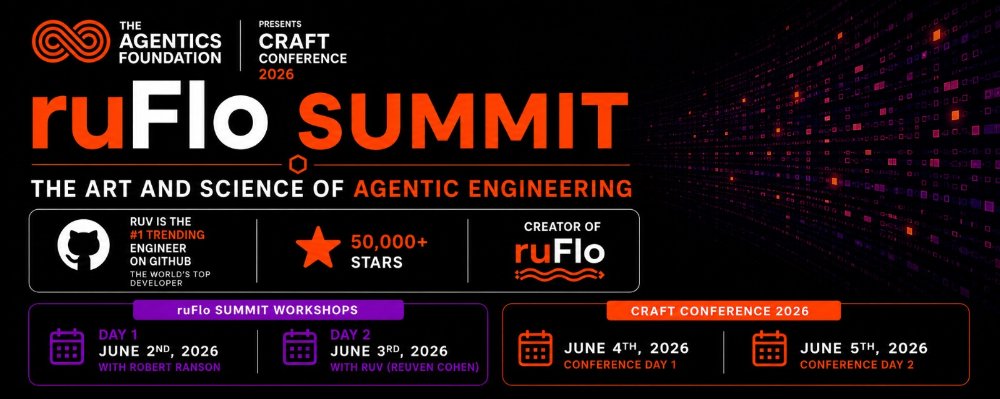

# 🇭🇺 ruFlo Summit — Budapest (June 2–3, 2026)

A **2-day, in-person ruFlo Summit** at Craft Conference in Budapest.
Two working days, not presentations.

Ruv will be there all week — this is very likely the only in-person ruFlo workshop he'll run in Europe this year.

---

## 🗓️ Agenda

| Day | Date | Title | Lead |
|---|---|---|---|
| **Day 1** | Tue, June 2 | **Building Blocks of a Meta-Harness** | Robert Ranson |
| **Day 2** | Wed, June 3 | **Masterclass: From the Meta-Harness and Beyond: ruFlo** | Ruv (Reuven Cohen) |

> Conference days follow immediately after: **June 4–5**.

---

## 🧠 Why a meta-harness?

Most people are still building harnesses. A **meta-harness** is the layer around that.

| Layer | What it does |
|---|---|
| Harness | Runs the system |
| **Meta-harness** | Observes outputs and behavior · Evaluates them · Adapts and evolves the harness itself over time |

It's the outer loop. If your system can't improve itself, you're the chokepoint.

| Day | Focus |
|---|---|
| Day 1 | Getting and using the components of that layer |
| Day 2 | What happens when you plug ruFlo in |

---

## 👤 About Ruv

Ruv is currently the **#1 trending engineer on GitHub**.

| Metric | |
|---|---|
| Weekly downloads across repos | approaching **~1M** |
| What he's building | the systems many of you are already experimenting with |
| Day 2 format | not a walkthrough — working directly with the framework's author |

---

## 🛠️ What you'll actually do

### Day 1 — Robert Ranson

| | |
|---|---|
| 🧱 | Structures of a meta-harness |
| 🔁 | Evaluation loops that are usable, not theoretical |
| 🚨 | Identifying failure modes early |
| 🌱 | Getting to something that can **evolve**, not just run |

### Day 2 — Ruv

| | |
|---|---|
| 🔌 | Applying ruFlo inside that structure |
| ⚙️ | Orchestration patterns that hold under pressure |
| 🚀 | Extending beyond the initial harness design |
| 🛣️ | Where this is going next |

---

## 🤝 The part people usually underestimate

Ruv is there all week. We're also organizing:

| | |
|---|---|
| 🏛️ | An **Agentics Foundation** meetup |
| 🍝 | Small group dinners |
| 💬 | Time to actually sit down with other builders |

This is where a ton of the value shows up.

---

## 📍 Location

| | |
|---|---|
| City | Budapest, Hungary |
| Event | Craft Conference 2026 |
| Summit days | June 2–3 |
| Conference days | June 4–5 (right after) |

---

## 🎟️ Registration (discount included)

| | |
|---|---|
| Register | https://ti.to/crafthub/craft-conference-2026/discount/AgenticsFoundation20 |
| Conference info | https://craft-conf.com/2026 |

---

## 🎯 Who should come

This will land if:

| | |
|---|---|
| ✅ | You're already building with agents and orchestration systems |
| ✅ | You're pushing past static workflows |
| ✅ | You care about systems that evolve over time |

If you're early, you'll still get value — but this is not an intro track.

---

## 🔭 Final thought

There is a clear shift happening:

> from building systems that **run**
> to building systems that **improve themselves**

That shift isn't obvious until you work on it directly. If you want to understand it properly, you should be in the room.

— Robert Ranson
